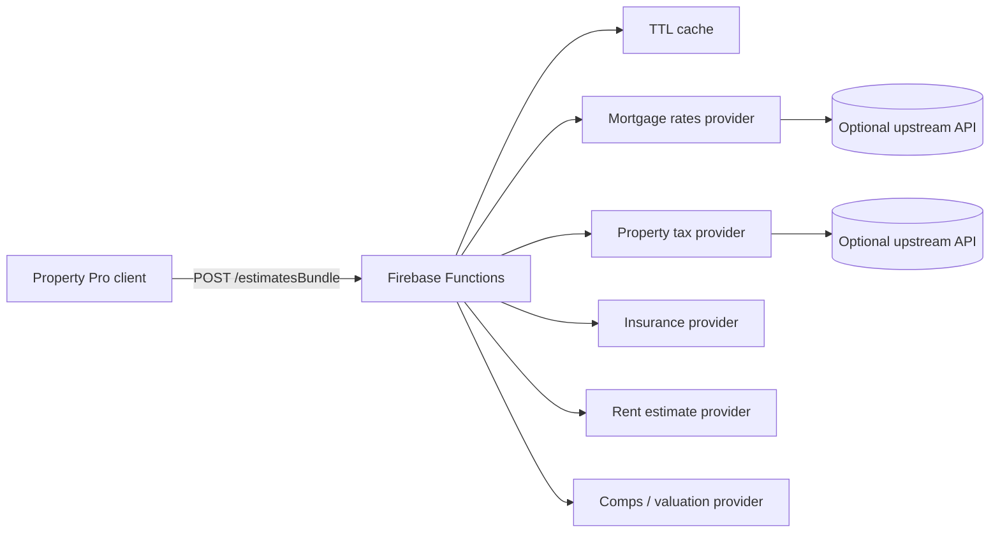

# External estimate proxy (Phase 8)

Server-side proxy/cache endpoints keep third-party API keys off the client. The Property Pro app calls a configured `VITE_ESTIMATE_API_BASE_URL` and falls back to offline heuristics when the proxy is unavailable.

## Architecture



## Deployed endpoints

All endpoints accept `POST` with JSON body:

```json
{
  "homePrice": 500000,
  "propertyAddress": "123 Main St, Austin, TX 78701",
  "zipCode": "78701",
  "termYears": 30,
  "downPaymentPercent": 20
}
```

| Function export | Path suffix | Category |
| --- | --- | --- |
| `estimatesBundle` | `/estimatesBundle` | All categories (client default) |
| `estimatesMortgageRates` | `/estimatesMortgageRates` | Mortgage rate → `interestRateApr` |
| `estimatesPropertyTax` | `/estimatesPropertyTax` | Property tax → `propertyTaxAnnual` |
| `estimatesInsurance` | `/estimatesInsurance` | Insurance → `insuranceAnnual` |
| `estimatesRent` | `/estimatesRent` | Rent → `monthlyRent` |
| `estimatesComps` | `/estimatesComps` | Valuation → `currentHomeValue` |

Responses map to existing scenario fields. The UI still requires explicit checkbox selection before apply.

## Environment

### Client (`.env.local`)

```bash
VITE_ESTIMATE_API_BASE_URL=https://us-central1-your-project.cloudfunctions.net
VITE_ESTIMATE_API_TIMEOUT_MS=12000
```

For GitHub Pages, add repository secret `VITE_ESTIMATE_API_BASE_URL` and pass it in the deploy workflow.

### Functions (`functions/.env` for emulator, Firebase params for prod)

Copy [`functions/.env.example`](../functions/.env.example). Key settings:

- `ALLOWED_ORIGINS` — comma-separated browser origins (CORS)
- `RATE_LIMIT_PER_IP` / `RATE_LIMIT_PER_USER` — rolling 60s windows
- `UPSTREAM_TIMEOUT_MS` — upstream fetch timeout
- `CACHE_TTL_SECONDS` — in-memory cache TTL (default 6h)
- `*_API_URL` / `*_API_KEY` — optional upstream providers

Secrets (`*_API_KEY`) must only live in server env — never in `VITE_*` client vars.

## Deploy

```bash
cd mortgage-pro
npm --prefix functions ci
npm --prefix functions run build
firebase deploy --only functions
```

First-time setup:

1. `firebase login`
2. `firebase use your-project-id`
3. Set function secrets / params in Firebase console or `firebase functions:secrets:set`

### Local emulator

```bash
cp functions/.env.example functions/.env
npm --prefix functions ci
firebase emulators:start --only functions
```

Point the client at the emulator base URL, e.g. `http://127.0.0.1:5001/your-project/us-central1`.

## Provider limitations

- Without upstream URLs configured, functions return **server heuristics** (similar to the offline stub) with `confidence: low`.
- Upstream integrations expect simple JSON shapes (`apr`, `annualTax`, `monthlyRent`, `value`, etc.). Adapt your vendor API with a thin adapter service if needed.
- Rate limiting and cache are **in-memory per function instance** — limits are best-effort under horizontal scale; use Firebase/App Check + API gateway for stricter production controls.
- CORS rejects requests without an allowed `Origin` header (direct curl without Origin receives 403 by design).
- Only mapped scenario fields are emitted; suggestions never auto-apply in the client.

## Tests

```bash
npm --prefix functions test
npm --prefix functions run typecheck
npm test
npm run lint
npm run build
```
