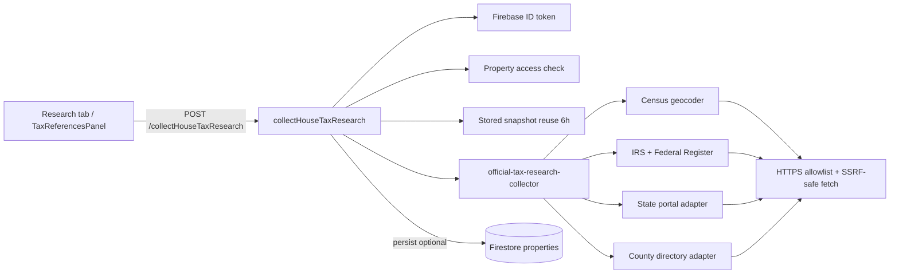

# Per-house external tax research

Server-side collection of **official** tax reference links for a saved property. Snapshots live in `scenario.research.externalTaxResearch` and stay separate from user-curated `taxIssues`.

## Architecture



| Layer | Role |
| --- | --- |
| Client | Builds request from saved house + scenario address fields; merges returned snapshot locally; normal save flow persists to Firestore. |
| `collectHouseTaxResearch` | Auth, CORS, rate limit, cache, access, fingerprint check, optional server persist. |
| `productionTaxResearchCollector` | Parallel geocoder + federal + state + county adapters; dedupes and bounds output. |
| `safeFetchText` | Only fetches `https` URLs on `.gov` / `.mil` / `.edu` hosts; validates every redirect hop. |

## Endpoint contract

**Export:** `collectHouseTaxResearch` (Firebase Functions v2, `us-central1`)

**Method:** `POST` only (`OPTIONS` for CORS preflight)

**Path:** `{VITE_TAX_RESEARCH_API_BASE_URL or VITE_ESTIMATE_API_BASE_URL}/collectHouseTaxResearch`

**Headers**

| Header | Required | Notes |
| --- | --- | --- |
| `Authorization` | Yes | `Bearer <Firebase ID token>` |
| `Origin` | Yes (browser) | Must match `ALLOWED_ORIGINS` |
| `Content-Type` | Yes | `application/json` |

**Request body**

```json
{
  "propertyDocId": "firestore-doc-id",
  "propertyAddress": "123 Main St, San Francisco, CA",
  "propertyPlaceId": "ChIJ…",
  "propertyPostalCode": "94107",
  "propertyState": "CA",
  "propertyLatitude": 37.78,
  "propertyLongitude": -122.39,
  "persist": true,
  "forceRefresh": false
}
```

- `propertyDocId` — required Firestore `properties/{id}` doc id for the active house.
- At least one identity field required (address, place id, postal code, or coordinates).
- `persist` — default `true`; when `true`, server merges bounded snapshot into the property doc (see Persistence).
- `forceRefresh` — default `false`; when `true`, bypasses a fresh stored snapshot and re-runs collectors.

**Success (200)**

```json
{
  "ok": true,
  "snapshot": { "collectionStatus": "complete", "addressFingerprint": "…", "collectedAt": "…", "normalizedReferences": [], "errors": [] },
  "persisted": true,
  "cacheHit": false,
  "accessRole": "owner"
}
```

**Errors**

| Status | When |
| --- | --- |
| 400 | Invalid JSON body or missing identity |
| 401 | Missing/invalid Bearer token |
| 403 | CORS origin rejected or no property access |
| 404 | Property doc not found |
| 409 | Request address identity does not match saved scenario |
| 429 | Rate limit exceeded |
| 502 | Collector/upstream failure |

## One Firebase project / centralized DB accessor

All Firestore Admin access goes through [`functions/src/db.ts`](../functions/src/db.ts) (`getDb()`). No other Functions source file may import `firebase-admin/firestore` or `getFirestore` — enforced by `functions/src/db.test.ts`.

`initializeApp()` runs once in [`functions/src/index.ts`](../functions/src/index.ts). Auth uses `firebase-admin/auth` in [`functions/src/http/auth.ts`](../functions/src/http/auth.ts).

## Authentication

1. Client signs in via Firebase (Anonymous or Google).
2. Client sends `Authorization: Bearer <ID token>` on each collect request.
3. Server verifies token with Admin SDK and resolves `uid`.
4. Server loads `properties/{propertyDocId}` and checks `userId` (owner) or `memberUids` (member) via `resolvePropertyAccess`.

Unauthenticated or cross-tenant requests receive 401/403.

## Approved source behavior

Collectors only emit links that pass server-side allowlisting:

- **Hosts:** `https` only; hostname ends with `.gov`, `.mil`, or `.edu` (plus explicit `irs.gov` entries).
- **Fetch:** `safeFetchText` / `safeFetchJson` in [`functions/src/providers/taxResearch/fetch.ts`](../functions/src/providers/taxResearch/fetch.ts).
- **Persistence & responses:** `boundTaxResearchSnapshot` re-validates every URL before write/return.
- **Provenance:** `sourceProvenance.sources` lists canonical URLs actually fetched.

Adapters (production collector):

| Adapter | Source |
| --- | --- |
| Geocoder | US Census Geocoder (county resolution) |
| Federal | Curated IRS pages + Federal Register API |
| State | Per-state official portal catalog |
| County | Per-state county assessor directory (when geocoder resolves county) |

## CORS / SSRF controls

**CORS** ([`functions/src/http/cors.ts`](../functions/src/http/cors.ts)):

- Requests without an allowed `Origin` → 403 (including direct `curl` without Origin).
- Configure `ALLOWED_ORIGINS` (comma-separated, no trailing slash).

**SSRF** ([`functions/src/taxResearch/allowedUrls.ts`](../functions/src/taxResearch/allowedUrls.ts), `fetch.ts`):

- Block non-HTTPS and non-allowlisted hosts before any outbound request.
- Manual redirect handling (`redirect: "manual"`) — each hop re-validated; max 5 redirects.
- Response size cap (512 KB default), timeout (8s default, from `UPSTREAM_TIMEOUT_MS`).
- No user-supplied URLs in the request body are fetched.

## 6-hour cache

Two aligned TTLs default to **21 600 seconds (6 hours)**:

| Location | Mechanism |
| --- | --- |
| Server | `CACHE_TTL_SECONDS` — `findReusableTaxResearchSnapshot` reuses `scenario.research.externalTaxResearch` when fingerprint matches, status is `complete` or `partial`, and `collectedAt` is within TTL. |
| Client UI | `DEFAULT_TAX_RESEARCH_SNAPSHOT_TTL_MS` (21 600 000 ms) — freshness label in Research tab. |

Cache hit responses set `cacheHit: true`, `persisted: false`, and skip collector + server persist.

## Refresh

- **Collect** — uses cache when fresh (server-side reuse).
- **Refresh** — client sends `forceRefresh: true`; server skips stored snapshot, re-runs adapters, persists when `persist !== false`.
- Stale snapshots (past TTL), failed/pending status, or fingerprint mismatch also trigger full collection.

## Persistence

Server persist (`persist: true`, default):

- Transaction merge into `properties/{id}.scenario.research.externalTaxResearch`.
- Preserves manual fields (`taxIssues`, `notes`, `links`, etc.).
- Updates `updatedAt` / `lastOpenedAt` only — **does not** bump `collaboration.revision` (machine snapshot; client merge + normal save handles revision).

Client flow after collect:

1. Merge snapshot into local research state (`mergeExternalSnapshotIntoResearch`).
2. User save / autosync writes full scenario through the standard revision path.

`externalTaxResearch` and `taxIssues` are never auto-merged.

## County limitations

- County links depend on Census geocoder resolving county + state.
- If request `propertyState` disagrees with geocoder state → county adapter skipped (`geocoder_state_mismatch`).
- County **directory** is per-state (official BOE/contact pages), not per-parcel assessor deep links — many counties lack deterministic parcel URLs.
- States without a mapped directory return `county_directory_unavailable`.
- Collection may be `partial` when some adapters fail but others succeed.

## Env / deploy

### Client (`.env.local`)

```bash
# Dedicated tax research base URL (preferred)
VITE_TAX_RESEARCH_API_BASE_URL=https://us-central1-your-project.cloudfunctions.net
# Fallback when tax URL unset
VITE_ESTIMATE_API_BASE_URL=https://us-central1-your-project.cloudfunctions.net
VITE_TAX_RESEARCH_API_TIMEOUT_MS=35000
```

GitHub Pages: add secret `VITE_TAX_RESEARCH_API_BASE_URL` (optional; falls back to `VITE_ESTIMATE_API_BASE_URL`).

### Functions (`functions/.env` / Firebase params)

Same shared settings as estimate proxy — see [`functions/.env.example`](../functions/.env.example):

- `ALLOWED_ORIGINS` — include Pages origin
- `CACHE_TTL_SECONDS=21600`
- `RATE_LIMIT_PER_IP`, `RATE_LIMIT_PER_USER`, `UPSTREAM_TIMEOUT_MS`

Deploy:

```bash
npm --prefix functions ci
npm --prefix functions run build
firebase deploy --only functions:collectHouseTaxResearch
# or: firebase deploy --only functions
```

Emulator:

```bash
cp functions/.env.example functions/.env
firebase emulators:start --only functions
# Client: VITE_TAX_RESEARCH_API_BASE_URL=http://127.0.0.1:5001/<project>/us-central1
```

## Test commands

**CI / unit (no live network for collectors — fixtures mock fetch):**

```bash
npm --prefix functions test
npm --prefix functions run typecheck
npm test
npm run lint
npm run build
```

**Opt-in live smoke (official adapters, real HTTPS — not run in CI):**

```bash
npm run functions:build
npm run tax-research:live-smoke -- --network --address "123 Main St, San Francisco, CA" --state CA --postal 94107
```

Requires explicit `--network`, `--address`, and a prior `functions:build`. See [`functions/scripts/taxResearchLiveSmoke.mjs`](../functions/scripts/taxResearchLiveSmoke.mjs).
